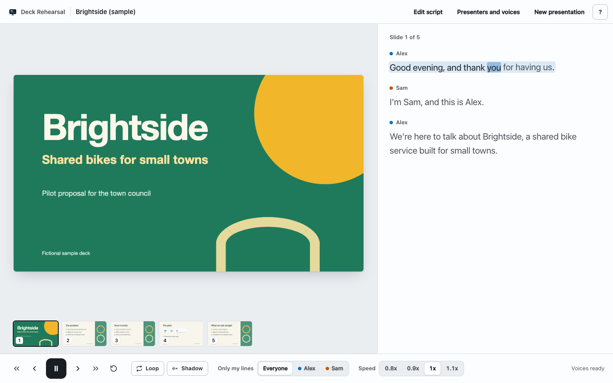

# Deck Rehearsal

Rehearse a slide presentation out loud. Drop in your slides, and a natural voice reads your script sentence by sentence with every word highlighted, so you can repeat it, shadow it, and get it into your mouth before the real thing.



**[Open the app](https://parsahoo.github.io/deck-rehearsal/)** or **[try the sample deck](https://parsahoo.github.io/deck-rehearsal/#sample)**

## Quick start

1. Drop your slides as a PDF (up to 60 pages and 50 MB).
2. Keep the draft script made from your slides, paste your own, or use the free AI chat helper.
3. Press **Start practicing**, then Space to play.

## Why

Presenting in a second language, or presenting something that matters (a pitch, a thesis defense, a grant committee), usually means reading the script again and again. Hearing it spoken naturally, one sentence at a time, and repeating it right after (shadowing) builds fluency much faster than silent reading.

## Privacy

Your PDF, your script and the generated audio never leave your device. There is no server, no account, no analytics and no API key. The only network traffic is the app itself, pinned open source libraries and their WebAssembly runtime from jsDelivr, and the open voice model from Hugging Face. Everything you do is saved in your browser (IndexedDB) so you can close the tab and pick up where you left off.

Safari may clear site data after 7 days without a visit. Chrome and Edge keep it unless you clear it.

## Download size

The voices run on your computer with [Kokoro](https://huggingface.co/hexgrad/Kokoro-82M), an open 82 million parameter text to speech model.

- Chrome or Edge with a recent GPU (WebGPU): about 350 MB, once. Voices are generated about as fast as they are spoken.
- Other browsers and devices (WebAssembly): about 120 MB, once. Voices are generated about 2 times slower than they are spoken, so expect short pauses between sentences at first.

The browser keeps the model in its cache, so later visits start right away. The sample deck ships with pre-rendered audio and plays immediately.

## Browser support

- Chrome and Edge on a laptop or desktop: best experience.
- Safari 18 or newer on macOS: works, with slower voice generation.
- Firefox: not tested yet.
- Phones: the layout does not break, but this is built for a laptop.

## Keyboard shortcuts

| Key | Action |
| --- | --- |
| Space | Play or pause |
| Left / Right | Previous or next sentence |
| Up / Down | Previous or next slide |
| R | Replay the sentence from its start |
| L | Loop the sentence |
| S | Shadow mode: a pause after each sentence to say it back |
| F | Cycle "only my lines" |
| [ / ] | Slower or faster (0.8x to 1.1x) |
| ? | Shortcuts and the guided tour |

## Script format

```
Slide 1
Alex: Good morning. Thank you for having us.
Sam: I will start with the problem.

Slide 2
Sam: Most teams rehearse by reading silently.
```

- Start each slide with a `Slide N` line. `Slide N:`, `Slide N - Title` and `---` separators also work.
- Put a name and a colon in front of a line to give it to a presenter. Lines without a name continue the previous presenter.
- A prefix only counts as a presenter if it is used at least twice, or if you typed the name in the AI helper. So `Note:` or `Step 1:` used once stays part of the text.
- Pasted AI answers are cleaned up for you: code fences, markdown, bold names, and the chatter before and after the script are ignored.
- No slide markers at all? Paragraphs are spread evenly over the slides and the preview tells you so.

## Run locally

There is no build step. Download the ZIP from GitHub (or clone the repo), then from the project folder:

```
python3 -m http.server 8000
```

Open http://localhost:8000. Any static file server works; opening `index.html` from the file system does not, because browsers block modules and workers there.

Run the unit tests (Node 20 or newer, no dependencies):

```
node --test tests/*.test.js
```

## How it works

- `js/pdf.js` reads the PDF with [pdf.js](https://mozilla.github.io/pdf.js/) (`pdfjs-dist@5.4.624`): page text for the draft script, thumbnails, and the large slide.
- `js/script-parser.js` turns a script (or a messy AI answer) into slides, presenters and paragraphs. `js/sentences.js` splits sentences and estimates word timing.
- `js/tts-worker.js` runs Kokoro through [kokoro-js](https://www.npmjs.com/package/kokoro-js) (`kokoro-js@1.2.1`) in a Web Worker, one sentence at a time, WebGPU first and WebAssembly as the fallback. kokoro-js downloads the model from the main branch of `onnx-community/Kokoro-82M-v1.0-ONNX` on Hugging Face.
- `js/tts.js` keeps the generation queue in the order you will hear it and caches every clip by a hash of its text, voice and model settings. Editing one sentence regenerates only that sentence. Changing speed regenerates nothing.
- `js/player-state.js` is a pure, unit tested reducer for playback. `js/player.js` wires it to one audio element.
- `scripts/render-audio.mjs` pre-renders the sample deck and the voice previews. Maintainers only.
- `sample/src/slides.html` is the source of the sample deck: print it to PDF to rebuild `sample/brightside.pdf`.

## License and disclaimer

MIT, see [LICENSE](LICENSE). The software is provided "as is", without warranty of any kind. The maintainers run no servers and store no data; everything happens in your browser.

Kokoro-82M is released under the Apache 2.0 license. pdf.js is released under the Apache 2.0 license. The Brightside sample deck is fictional: no real company, person or data.
